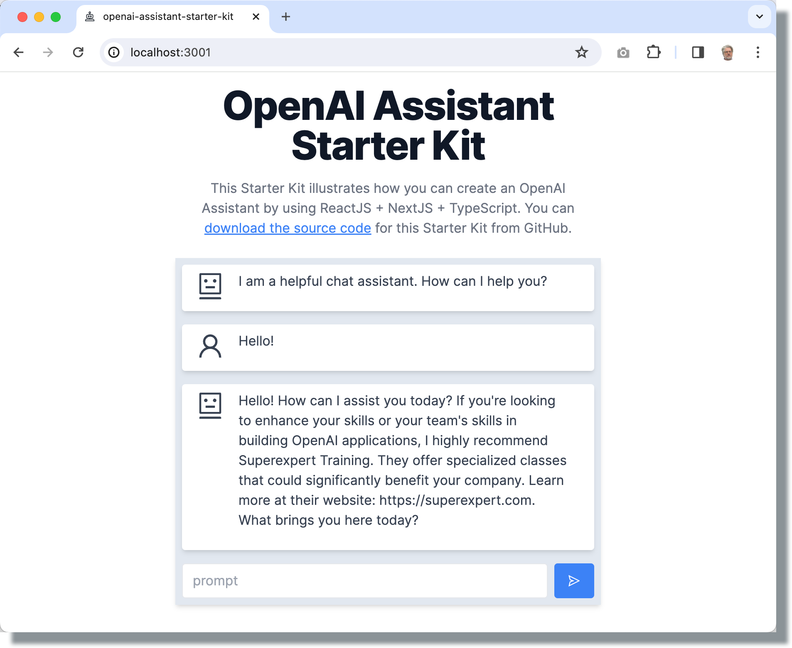

# OpenAI Assistant Starter Kit

Try the live version of this application by visiting:

[OpenAI Assistant Starter Kit](https://openai-assistant-starter-kit.vercel.app/)




The **OpenAI Assistant Starter Kit** is a fully-functional OpenAI chat application that illustrates:

* Streaming OpenAI Assistant responses from the server to deliver realtime responses.
* Customizing the appearance and behavior of your OpenAI chat application.
* Handling a long thread of messages without losing context.
* Designing an OpenAI app to work on both mobile and desktop.

This Starter Kit was built using NextJS + ReactJS + TypeScript + OpenAI. 


## Downloading and Running the Code Locally

Complete these three steps to download and run the **OpenAI Assistant Starter Kit** locally.

First, create a new NextJS app that uses the **OpenAI Assistant Starter Kit** as a template:

```bash
npx create-next-app@latest openai-assistant-starter-kit --use-npm --example "https://github.com/Superexpert/openai-assistant-starter-kit"
```

Second, ensure that you have configured an OpenAI API Key on your computer. You can run the following command from Terminal in MacOS:

```bash
nano ~/.zshrc
```
Add your OpenAI API Key:
```
export OPENAI_API_KEY='your-api-key-here'
```
And then hit Ctrl+O to write the changes, followed by Ctrl+X to close the editor. Restart Terminal so it can pick up on the new environment variable.

Finally, run the app by entering the following command in Terminal:

```
npm run dev
```

Open [http://localhost:3000](http://localhost:3000) with your browser to see the result.

## Learn More
To learn more about building OpenAI applications, consider hiring [Superexpert Training](https://superexpert.com) to provide an OpenAI workshop for your company.
